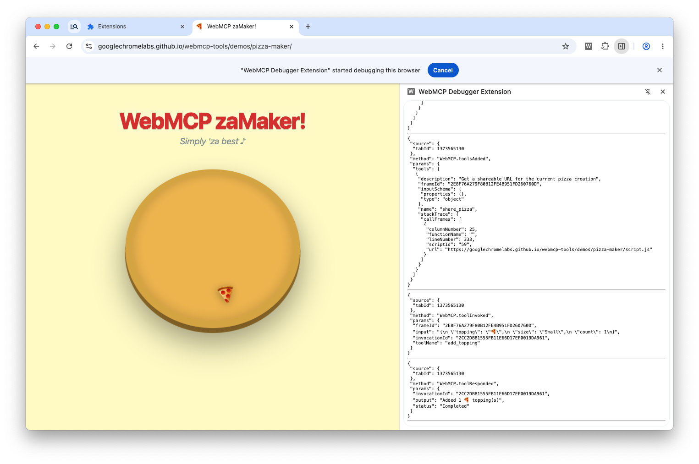

# WebMCP Debugger Extension

This Chrome extension uses the `chrome.debugger` API to inspect WebMCP tools on web pages. It provides a side panel that displays real-time events from the WebMCP protocol.

## Features

- **Side Panel Integration**: Opens a dedicated side panel when the extension icon is clicked.
- **Debugger Attachment**: Automatically attaches the Chrome DevTools debugger to the active tab.
- **Event Logging**: Captures and displays `WebMCP` events (e.g., tool calls, state changes) directly in the side panel.

## Files

- `manifest.json`: Defines the extension's permissions (`debugger`, `sidePanel`, `tabs`), background service worker, and action behavior.
- `background.js`: Configures the side panel to open on action click and ensures it's available for all tabs.
- `sidepanel.html`: The user interface for the debugger output.
- `sidepanel.js`: Handles debugger attachment, enables the `WebMCP` domain, and listens for incoming events to display them.

## How to Install

1. Open Chrome and navigate to `chrome://extensions/`.
2. Enable **Developer mode** in the top right corner.
3. Click **Load unpacked**.
4. Select the `webmcp/debugger-extension` directory.

## How to Use

1. Navigate to a web page that uses WebMCP tools.
2. Click the **WebMCP Debugger Extension** icon in your browser's toolbar.
3. The side panel will open, and it will begin displaying WebMCP debugger events as they occur on the page.
